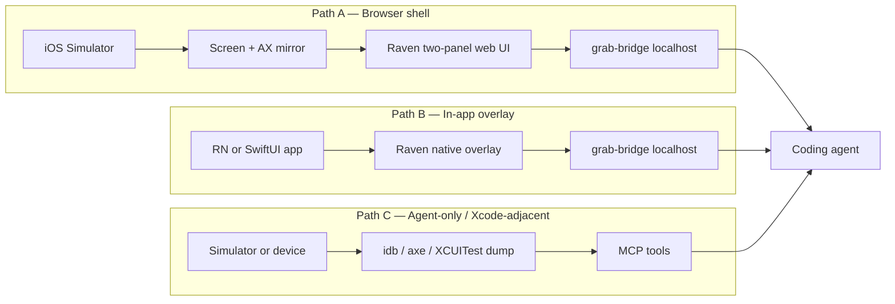

# Spec: Raven Design two-panel Grab for mobile apps

**Status:** draft planning spec (2026-07-19) · **M0 scaffolding live in `mobile-grab/`**  
**Owner:** product / grab  
**Related:** `docs/grab-designmd-spec.md`, `docs/grab-panel-v2-spec.md`, f23 two-panel Structure + Design chrome, existing `audit_ios_*` / `audit_rn` tools

**Code home (collision-safe):** everything for Path A M0 lives under `mobile-grab/` — own server on port **49911**, own shell, own SwiftUI sample. Does not modify `browser/raven-grab.js` or `src/grab-bridge.ts`.

---

## 1. Goal / intent

Bring the **same Raven Design two-panel Grab loop** (Structure left · Design right · click-to-select · send intent to agent) to **native and React Native mobile apps**, without forcing every team into a single host environment.

Answer the two platform questions up front:

| Question | Answer |
|----------|--------|
| **Do you have to run the emulator in the browser?** | **No.** Browser-mirrored Simulator is the best *agent + desktop panel* path, but it is not required. |
| **Can it work in Xcode?** | **Yes for capture/driving the app; no for hosting the Raven panels inside Xcode’s UI.** Xcode Simulator (or device) runs the app; Raven’s two-panel chrome lives in a companion surface (browser shell, Cursor agent tools, or an in-app / floating macOS panel). |

Ideal state: a designer or engineer can point at a live mobile screen the way they point at a web page today — select a layer, see tokens/styles/scope, send an instruction — and the coding agent gets a structured payload.

---

## 2. Customers (dual lens)

### Primary — paying team
Product/design teams with iOS and/or RN apps, shared design system, and AI agents in the loop. They need IT-safe setup, clear consent for what leaves the machine, and a workflow that fits existing Simulator/Xcode habits.

### Free — solo indie
Expo / RN indie who already has under-a-minute web Grab. They bounce if mobile Grab requires a week of native plumbing or only works in an obscure browser mirror.

**Delta question:** Team needs reliable AX-tree fidelity + admin-clear story; indie needs one command + familiar Raven chrome.

---

## 3. What “similar two-panel Grab” means (contract)

Preserve the **product contract**, not the DOM implementation:

| Web Grab today | Mobile Grab must provide |
|----------------|--------------------------|
| Hover highlight + click select | Point/tap select with visible highlight |
| Left: Structure (layers / reorder intent) | Left: accessibility / component tree |
| Right: Design (tokens, styles, instructions, scope) | Right: same Raven Design chrome (adapt fields) |
| `POST /grab` → `get_grabbed_elements` | Same bridge queue semantics |
| DESIGN.md / token map when available | Token map from design system source (DESIGN.md, DTCG, RN theme, asset catalog names where possible) |
| Instance / All siblings scope | Same mental model when match set ≥ 2 |
| Send to agent | Same CTA → agent applies code |

**Not required for v1:** pixel-perfect CSS editing, DOM reparent drag, script-tag injection into arbitrary native apps.

---

## 4. Why web Grab cannot just “run in the Simulator”

Today’s overlay (`browser/raven-grab.js`) assumes:

1. A **DOM** (`document`, `getComputedStyle`, CSS variables)
2. Ability to inject a **`<script>`** into the page (or proxy HTML)
3. Browser hit-testing

iOS/Android apps (and RN’s native trees) do **not** expose that surface. So mobile Grab needs a **new capture adapter** that feeds the same Raven chrome + bridge.

Raven already has adjacent native capability (source/static + snapshot audits): `audit_swiftui`, `audit_rn`, `audit_ios_screen`, `audit_ios_a11y`, AccessibilitySnapshot / XCUITest harness notes. Grab is the **interactive selection loop** on top of that world — not a replacement for those audits.

---

## 5. Architecture options (three paths)



### Path A — Browser-mirrored Simulator + Raven two-panel shell (recommended v1 for “feels like web Grab”)

**How it works**
- Boot app in **Xcode Simulator** (normal).
- A small local service mirrors the sim framebuffer into a **browser tab** and overlays the **accessibility tree** for hit-testing (prior art: `sim-grab`, `agent-simulator`).
- Raven’s **two-panel Design UI** runs in that browser (reuse Raven Design chrome / tokens), talking to the existing **grab-bridge**.
- Click on the mirrored screen → select AX (and optionally RN fiber) node → Structure + Design panels populate → Send to agent.

**Pros**
- Closest UX to current web Grab (desktop panels, hover, layers).
- Agents in Cursor/Claude can see/drive the same URL.
- Works for **SwiftUI, UIKit, RN, Flutter** as long as AX is exposed.
- Does not require shipping Raven UI inside the customer’s app binary for v1.

**Cons**
- Extra process (mirror + browser).
- Not “inside Xcode”; Xcode is only where the app runs.
- AX tree can be coarser than DOM (need point refinement).

**Do you need the emulator in the browser?** For Path A, **yes — the *preview* is in the browser**. The emulator itself still runs as Apple’s Simulator.

### Path B — In-app Raven overlay (best for RN; possible for SwiftUI)

**How it works**
- Dev-only SDK: RN package (and later SwiftUI package) mounts a Raven overlay in the running app.
- Tap-to-inspect via RN inspector APIs / native hit-testing.
- Panels: either **in-app** (cramped on phone) or **companion** (push selection to localhost bridge; panels open on desktop — preferred).
- Talks to the same grab-bridge.

**Pros**
- Works on **device** and Simulator without a browser mirror.
- Strong RN source mapping (fiber / symbolicate) — similar to react-grab enrichment on web.
- Feels native to Expo/RN workflows (dev menu toggle).

**Cons**
- Phone screen is too small for full two-panel chrome → **desktop companion panels** are almost mandatory for “similar” UX.
- Native SwiftUI overlay is a second implementation.
- Must stay **dev-only** (never ship to App Store builds).

**Xcode?** App runs in Simulator/device from Xcode; overlay is in the app, panels on desktop.

### Path C — Agent/MCP selection without Raven chrome (thin v0)

**How it works**
- Extend MCP tools: `mobile_grab_tree`, `mobile_grab_at_point`, `mobile_grab_send` backed by `idb` / `axe describe-ui` / existing AccessibilitySnapshot.
- Agent drives selection; optional minimal CLI/TUI.
- No two-panel Raven Design UI yet.

**Pros**
- Fastest to a useful agent loop; reuses `audit_ios_*` capture lessons.
- Works from Xcode-booted Simulator with zero browser UI.

**Cons**
- Does **not** deliver the “similar Raven Design two-panel” experience.
- Worse for designers who want to click, not prompt.

**Role:** stepping stone / fallback when mirror or SDK isn’t available — not the product north star.

---

## 6. Recommended plan (phased)

### Decision (locked 2026-07-19)

**North star for M1 = Path A.** Grabs land in the **coding agent** (Cursor / Claude / etc.), not in Xcode or the IDE that boots the Simulator. A browser shell that reuses Raven Design chrome + grab-bridge is the right host: same send path as web Grab, no dependency on Xcode’s UI surface.

| Phase | Ship | Path | Why |
|-------|------|------|-----|
| **M0** | Feasibility spike | A (+ thin C samples OK) | Prove AX hit-test → grab payload on one RN + one SwiftUI sample |
| **M1** | Designer-usable v1 | **A** (browser shell + Raven two-panel) | Agent-bound loop; Simulator still from Xcode/simctl |
| **M2** | Indie RN under-a-minute | **B** (RN SDK → desktop panels) | No browser mirror required for Expo folks |
| **M3** | Native iOS SDK | **B** SwiftUI | Team iOS apps without RN |
| **M4** | Android parity | A and/or B for Android emulator | Same bridge; separate AX adapter |

**Explicit non-goals for M1**
- Hosting Raven panels *inside* Xcode’s IDE chrome
- Production/App Store inclusion of Grab
- Full layer reparent drag parity with web Structure panel (start with select + tree navigate + send)
- Phone-viewport panel takeover UI (see §9.1 — deferred)

### 6.1 Deferred — phone / mobile-browser panel chrome

When the Raven shell is used on a **phone browser** (or any narrow viewport), do **not** force desktop side-by-side panels. Future mode:

- Structure and Design each **take the full viewport**
- User **toggles** between the two panels (same contract, different layout)
- Mirrored sim / selection surface stays reachable (exact chrome TBD)

**Hold off:** do not design or build this for M0/M1. Desktop two-panel Path A is the v1 product. Capture only so we don’t paint ourselves into a desktop-only shell later (responsive shell shell, not a second product).

---

## 7. Platform answers (detail)

### 7.1 Browser emulator / mirror

| Mode | Required? | Notes |
|------|-----------|--------|
| Path A v1 | Mirror **preview** in browser | Simulator process still native |
| Path B | No | Inspect on device/sim; panels on desktop |
| Path C | No | MCP/AX only |

**Recommendation:** Document Path A as “open Simulator, then open Raven Mobile Grab URL” — not “run your app in Chrome.”

### 7.2 Xcode

| Capability | In Xcode? |
|------------|-----------|
| Build & run app | Yes (primary) |
| Boot Simulator / device | Yes |
| See Raven two-panel Design + Structure | **No** (companion browser or desktop panel) |
| Feed AX snapshots via XCUITest / AccessibilitySnapshot | Yes (already in Raven’s audit story) |
| Replace Xcode View Hierarchy Debugger | No — complementary, agent-oriented |

**Practical Xcode workflow (M1):**  
Xcode → Run → Simulator boots → `start_mobile_grab_session` → browser opens Raven shell mirroring that sim → designer uses two panels → agent pulls queue.

---

## 8. Payload & bridge (keep web Grab isomorphic)

Extend grab selection schema with a `platform` discriminant:

```ts
// Conceptual — not implemented yet
type MobileGrabSelection = {
  platform: "ios" | "android" | "react-native";
  source: "ax" | "rn-fiber" | "compose";
  // Identity
  label?: string;
  role?: string;
  identifier?: string;      // accessibilityIdentifier
  rnComponentName?: string;
  rnFile?: string;
  rnLine?: number;
  // Geometry (points)
  rect: { x: number; y: number; w: number; h: number };
  // Style / tokens (best-effort)
  styles?: Record<string, string>;
  tokens?: Array<{ property: string; name: string; value: string }>;
  tokenIntents?: /* same as web */;
  instruction?: string;
  editScope?: "instance" | "component"; // Instance / All siblings when matchCount >= 2
  matchSelector?: string;               // platform-specific matcher
  matchCount?: number;
  ancestors?: Array<{ label?: string; role?: string }>;
  screenshotCrop?: string;              // optional base64 crop for agent vision
};
```

**Bridge tools (proposed names)** — all `REMOTE_GATED` like web grab:

- `start_mobile_grab_session` — start mirror and/or wait for SDK; return browser URL + status
- `get_grabbed_elements` — **reuse** existing drain (same queue) with platform field
- `stop_mobile_grab_session`
- Optional: `mobile_grab_tree` for agent Path C

Reuse localhost grab-bridge; do not invent a second queue if one session can multiplex.

---

## 9. UI mapping (Raven Design chrome)

| Web panel | Mobile M1 adaptation |
|-----------|----------------------|
| Structure / Layers | AX tree (and RN tree toggle when available) |
| Reorder / reparent | Defer; show read-only tree + select |
| Design / tokens | Map RN theme / DESIGN.md / semantic colors when resolvable; else computed-ish props from AX + style inspector |
| Scope Instance / All siblings | Show when ≥2 matches by identifier/component |
| Instructions + Send | Unchanged |
| Harness control | Dev-only; never in customer app |

Panel layout for M1 stays **desktop two-panel** in the Path A browser shell. Path B phone overlay remains select-only + “Open on desktop” until §6.1 ships.

### 9.1 Deferred layout — full-viewport toggle (phone browser)

Not in M1. When we do build it: one panel visible at a time, whole viewport, toggle Structure ↔ Design; preserve selection context across toggles; Send stays reachable from Design. Exact toggle control (segmented control vs swipe vs nav) deferred with the rest of §6.1.

---

## 10. Security & trust

- Dev-only. Strip from Release configurations.
- Loopback bridge only (same as web Grab).
- No App Store distribution of Grab SDK without explicit product decision.
- Team lens: document what leaves the machine (screenshot crops, AX labels, source paths).
- Capability keys / CORS rules follow web Grab landmines (`docs/feasibility-ds-diff-templates-layers.md`).

---

## 11. Acceptance criteria

### M0 spike (1–2 days)
1. Boot sample RN app in Simulator; dump AX tree; select node at point; produce a JSON payload that validates against an extended grab schema.
2. Same for a tiny SwiftUI sample via `idb` or AccessibilitySnapshot.
3. Write-up: fidelity gaps (what AX cannot see vs DOM).

### M1 (designer-usable)
1. `start_mobile_grab_session` opens a Raven-branded shell with two panels.
2. Click mirrored sim → Structure highlights node; Design shows label/role/rect + instruction box.
3. Send → `get_grabbed_elements` returns mobile selection; agent can cite file/component when RN symbolicate available.
4. Setup path documented: Xcode run + one MCP/CLI command + browser URL.
5. Vision + customer walkthrough: indie “under a few minutes”; team “clear data story.”
6. `npm test` / gating: new tools remote-gated; anon 45-tool hash unchanged.

### M2 (RN SDK)
1. Expo/RN: `npx` or one import enables tap-inspect without browser mirror.
2. Selections still appear in desktop Raven panels via bridge.
3. Dev menu toggle; Release builds exclude overlay.

---

## 12. Risks & open questions

| Risk / question | Impact | Proposal |
|-----------------|--------|----------|
| AX tree too coarse for design tokens | High for Design panel fidelity | M1: instruction + identity first; tokens best-effort; M2 RN style inspector |
| “All siblings” semantics on native | Medium | Define matcher: same `accessibilityIdentifier` / RN component type under same parent when possible |
| Mirror latency / scroll sync | Medium | Prefer idb/axe stacks already used by sim-grab class tools |
| Duplicate ecosystem (sim-grab, agent-simulator) | Strategic | **Buy/borrow mirror, build Raven chrome + bridge** — don’t rebuild Simulator streaming |
| Android timing | Sequencing | After M1 iOS proof |
| Does Path A require always-on browser? | UX | Yes for panels; document clearly so Xcode-only users know to open the shell |

**Resolved product decisions:**
1. **M1 = Path A** — agent is the destination, not Xcode. Thin Path C samples OK in M0 only.
2. **Phone full-viewport panel toggle** — wanted later for mobile-browser use of the Raven shell; **hold off** until after M1 desktop Path A (§6.1 / §9.1).
3. **First sample app = SwiftUI** (2026-07-19) — not Expo/RN for M0/M1 proof.

**Still open (need Andrew call):**
1. M0 capture stack preference — see §12.1 (`idb` explained). Default proposal: start with **simctl + Apple AX / AccessibilitySnapshot** (already in Raven’s iOS audit story); treat Facebook `idb` as optional later if the mirror needs a richer driver.

### 12.1 What “idb” is (plain English)

**idb** = *iOS Development Bridge* (open-source, from Meta/Facebook). A CLI/daemon that talks to the iOS Simulator (and devices) so tools can:

- take screenshots / stream the screen  
- dump the **accessibility tree** (labels, roles, frames)  
- tap / swipe at coordinates  

It is **not** part of Xcode and **not** something end users install for normal app development. Agent/mirror tools (sim-grab-class stacks) often use it because Apple’s built-in `simctl` is weaker for “click this AX node.”

| Tool | Who makes it | What Raven needs it for |
|------|----------------|-------------------------|
| **Xcode + Simulator** | Apple | Build & run the SwiftUI app (already assumed) |
| **`simctl`** | Apple (`xcrun simctl`) | Boot sim, install/launch, basic screenshot |
| **AccessibilitySnapshot / XCUITest** | Apple + open libs Raven already references | Structured a11y dumps for audits |
| **`idb`** | Meta (optional) | Richer remote control + AX for a browser mirror |

**For you:** you do not need to learn or install `idb` to decide Path A. M0 can prove point-select → grab JSON with Simulator + existing Raven iOS capture paths first; only pull in `idb` if mirroring gets stuck without it.

---

## 13. Verification plan (for this spec doc)

| Check | How |
|-------|-----|
| Answers “browser required?” | §1 + §7.1 — No globally; Yes for Path A preview |
| Answers “works in Xcode?” | §1 + §7.2 — App yes; panels companion |
| Reuses web Grab contract | §3 + §8 |
| Respects Raven remote gates | §8 + §11 |
| Dual customer | §2 + M1 acceptance #5 |
| Feasible vs fantasy | §5 cites prior art; M0 spike gates build |

---

## 14. Suggested next action

**M0 scaffold is in `mobile-grab/`** — run `node mobile-grab/server.mjs` → http://127.0.0.1:49911 (fixture AX + SVG screen). Optional: `mobile-grab/scripts/run-sample.sh` then **Refresh from Simulator**.

Next toward M1:
1. Live AX dump from the SwiftUI sample (AccessibilitySnapshot / XCUITest) instead of fixture-only tree
2. Wire queue drain into MCP `get_grabbed_elements` (or mobile-specific remote-gated tool) without colliding with web grab
3. Keep phone full-viewport toggle deferred (§6.1)
